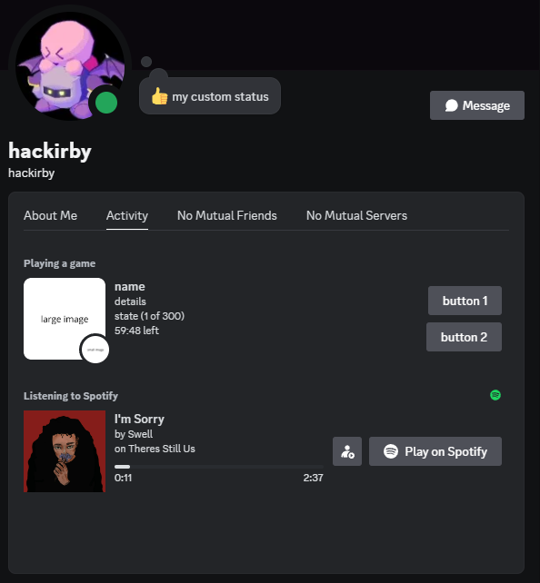
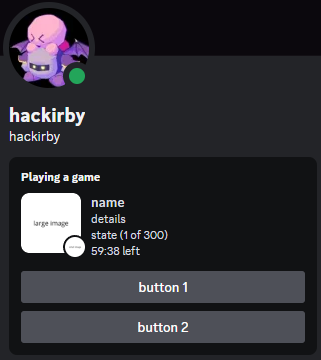
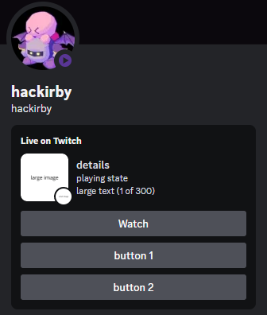
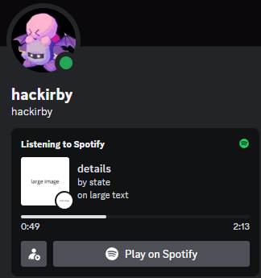
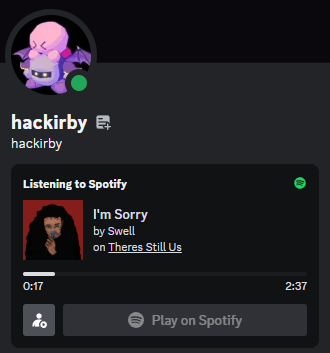
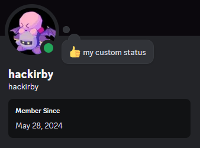

<br />
<div align="center">
  <h3>discordrpcgenerator</h3>
  <p>
    a simple go library to create custom discord presences without needing to keep discord open.
  </p>
</div>

## About The Project



While there are many excellent Discord RPC generators on GitHub, I wanted to create one in Go that doesn't require Discord to be open. This can be easily accomplished by sending an updateStatusData payload (opcode 3) through a Discord WebSocket connection.

I was able to implement working buttons and clickable Spotify fields thanks to the [discord.js-selfbot-v13](https://github.com/aiko-chan-ai/discord.js-selfbot-v13/) project. If you prefer JavaScript, it’s a great option to check out.

## Getting Started

### Prerequisites

* [The Go Programming Language](https://go.dev/dl/)
* [A Discord Application ID](https://discord.com/developers/applications/) (to use art assets)


### Installation

#### Install my modified discordgo

`go get github.com/hackirby/discordgo`

#### Install discordrpcgenerator

`go get github.com/hackirby/discordrpcgenerator`

### Basic Usage

To use this library, establish a Discord WebSocket connection with my custom discordgo package and set your presence with the discordrpcgenerator library.

```go
import (
	"os"
	"fmt"
	"os/signal"
	"github.com/hackirby/discordgo"
	"github.com/hackirby/discordrpcgenerator"
)

func main() {
    client, err := discordgo.New("your token here")
    if err != nil {
        fmt.Println("Error creating Discord session: ", err)
        return
    }

    err = client.Open()
    if err != nil {
        fmt.Println("Error opening Discord session: ", err)
        return
    }


    activity := discordrpcgenerator.NewRichPresence(client)
    // activity := discordrpcgenerator.NewSpotifyRichPresence(client)
    // activity := discordrpcgenerator.NewCustomStatus(client)

    presence := discordrpcgenerator.NewPresence()
    presence.SetStatus(discordgo.StatusOnline)
    presence.AddActivity(activity)

    client.SetPresence(presence.Data())

    // keep the program running
    sc := make(chan os.Signal, 1)
    signal.Notify(sc, os.Interrupt)
    <-sc
}
```

## Rich Presence

Create a rich presence with various customizable fields:

```go
r := discordrpcgenerator.NewRichPresence(client)

// 128 characters or less
r.SetName("name")
r.SetState("state")
r.SetDetails("details")

// ID of the application you created on the Discord Developer Portal
// required to get the art assets to show up
// required to get the buttons to work
r.SetApplicationID("applicationID")

// https://discord.com/api/v9/oauth2/applications/<applicationID>/assets
r.SetLargeImage("largeImageID")
r.SetSmallImage("smallImageID")

// You can also use external assets
// asset := ImageLinkToAsset(client, "applicationID", "https://imagelink.png")
// r.SetLargeImage(asset)
// r.SetSmallImage(asset)

// must be less than 32 characters
r.SetLargeText("large text")
r.SetSmallText("small text")

// create a one-hour timestamp
r.SetStartTimestamp(time.Now())
r.SetEndTimestamp(time.Now().Add(time.Hour))

// add buttons (max 2)
r.AddButton("button 1", "https://github.com/hackirby")
r.AddButton("button 2", "https://github.com/hackirby?tab=repositories")

// add party
r.SetParty("party ID", 1, 300)
```



For streaming activity:

```golang
r.SetType(discordgo.ActivityTypeStreaming)
r.SetURL("https://twitch.tv/hackirby")
```



## Spotify Rich Presence

```go
s := discordrpcgenerator.NewSpotifyRichPresence(client)

// s.SetName does not exist anymore
s.SetState("state")
s.SetDetails("details")
s.SetApplicationID("applicationID")
s.SetLargeImage("largeImageID")
s.SetSmallImage("smallImageID")
s.SetLargeText("large text")
s.SetSmallText("small text")

// you can't create a too large timestamp (ex: the one-hour timestamp does not work)
s.SetStartTimestamp(time.Now())
s.SetEndTimestamp(time.Now().Add(2 * time.Minute).Add(37 * time.Second))
```



To make our Spotify Rich Presence look authentic, we can add track, artist, and album IDs. This makes the fields clickable, allowing users to be redirected to these specific items on Spotify.


```go
s := discordrpcgenerator.NewSpotifyRichPresence(client)

s.SetState("Swell") // Artists (Artist 1; Artist 2)
s.SetDetails("I'm Sorry") // Song name

// Set Spotify IDs (found in the URLs on Spotify Web)
s.SetSongId("1XWLdjLUzNDxW7ggw8uQnM") // Song ID
s.SetAlbumId("6weHAeERW1hoGdgXtEP1QZ") // Album ID
s.AddArtistId("78xSB1R1x8T6o0QuRaodez") // Artist ID

// Find the image ID using https://developer.spotify.com/documentation/web-api/reference/get-track
s.SetLargeImage("spotify:ab67616d0000b273690b52d0ce9a2081dbbd2557") // Image ID
s.SetLargeText("Theres Still Us") // Album Name

// Song length = 2m37s
s.SetStartTimestamp(time.Now())
s.SetEndTimestamp(time.Now().Add(time.Minute * 2).Add(time.Second * 37))
```




## Custom Status

```go
c := discordrpcgenerator.CustomStatus(client)
c.SetState("my custom status")
c.SetEmoji("👍") // can be:
// - a discord emoji ID
// - the identifier string of an emoji <:name:id> or <a:name:id> for animated ones
// - the Unicode representation of an emoji
```



## License
This library is released under the MIT License. See LICENSE file for more informations.

## Contact
If you have any questions or need further assistance, please contact [@hackirby:matrix.org
](https://matrix.to/#/@hackirby:matrix.org)

## I'm Sorry

In this code, I opted to use panic() instead of adhering to the convention of returning errors. This decision was made because the errors encountered are typically due to user input not being a valid string. In these cases, the user simply needs to correct the input, and the program will continue functioning as expected.
